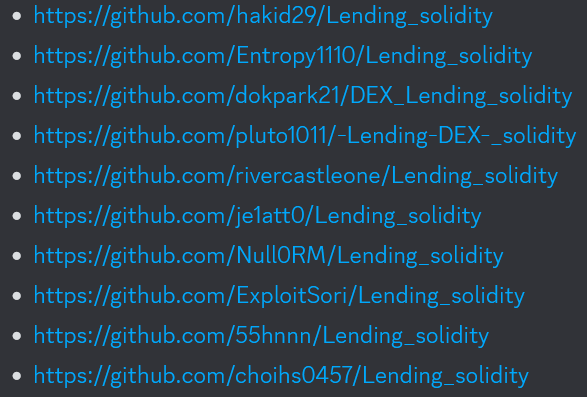

# Lending Audit

## Audit Overview

### Scope

<table>
  <tr>
    <th>Name</th>
    <td>Lending Security Audit</td>
  </tr>
  <tr>
    <th>Target / Version</th>
    <td>Git Repository (Lending_solidity): commit <mark>2645135fd3ab081ac2a74ab2c0dcf297e28f190c</mark> (<mark>master</mark> branch)</td>
  </tr>
  <tr>
    <th>Application Type</th>
    <td>Smart contracts</td>
  </tr>
  <tr>
    <th>Lang. / Platforms</th>
    <td>Smart contracts [Solidity]</td>
  </tr>
</table>

### Severity Categories

|Sevirty|Description|
|:---:|-------|
|Critical|The attack cost is low (not requiring much time or effort to succeed in the actual attack), and the vulnerability causes a high-impact issue. (e.g., Effect on service availability, Attacker taking financial gain)|
|High|An attacker can succeed in an attack which clearly causes problems in the service’s operation. Even when the attack cost is high, the severity of the issue is considered “high” if the impact of the attack is remarkably high.|
|Medium|An attacker may perform an unintended action in the service, and the action may impact service operation. However, there are some restrictions for the actual attack to succeed.|
|Low|An attacker can perform an unintended action in the service, but the action does not cause significant impact or the success rate of the attack is remarkably low.|
|Informational|Any informational findings that do not directly impact the user or the protocol.|

## Lists

All the audited member nicknames are encoded in Base64.

The report follows the same order as the image below.

1. [aGFraWQyOQ==](./audits/)
2. [RW50cm9weTExMTA=](./audits/)
3. [ZG9rcGFyazIx](./audits/)
4. [cGx1dG8xMDEx](./audits/)
5. [cml2ZXJjYXN0bGVvbmU=](./audits/)
6. [amUxYXR0MA==](./audits/)
7. [TnVsbDBSTQ==](./audits/)
8. [RXhwbG9pdFNvcmk=](./audits/)
9. [NTVobm5u](./audits/)
10. [Y2hvaWhzMDQ1Nw==](./audits/)